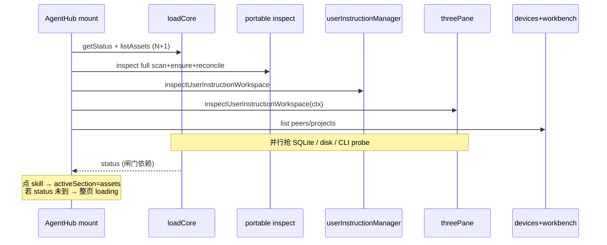
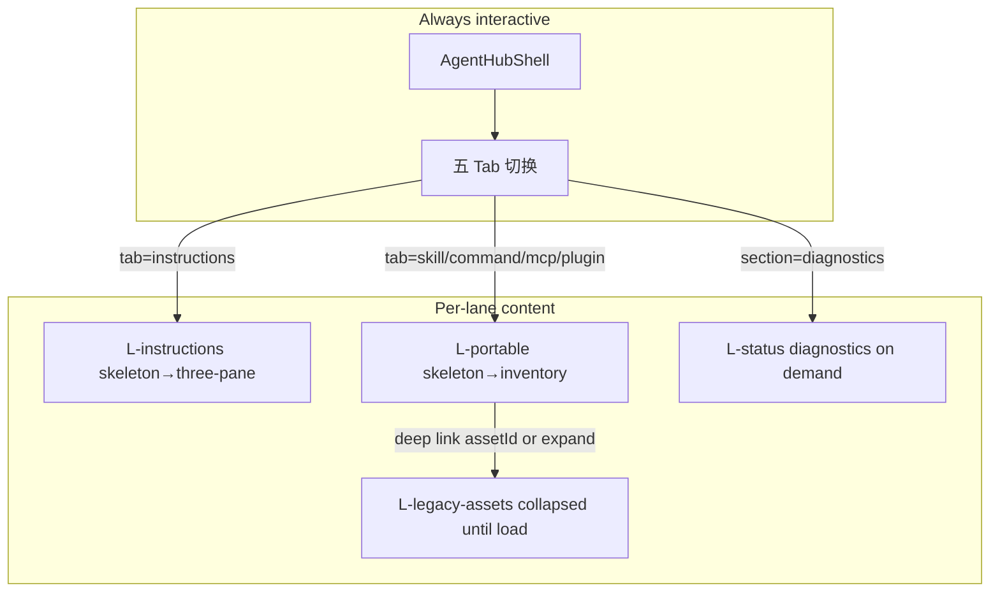
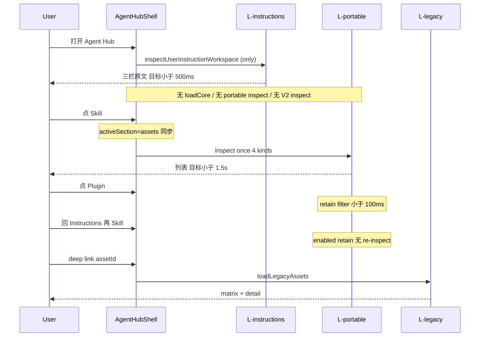

# Agent Hub 按需加载（On-Demand Loading）设计

| 字段 | 值 |
|------|-----|
| 文档标题 | Agent Hub 按需加载（On-Demand Loading） |
| 作者 | TBD |
| 日期 | 2026-08-08 |
| 状态 | Draft（review revision 1） |
| 上位 / 并行 | [`2026-08-08-agent-hub-interaction-redesign-design.md`](./2026-08-08-agent-hub-interaction-redesign-design.md) · [`2026-08-08-agent-hub-three-phase-refactor-design.md`](./2026-08-08-agent-hub-three-phase-refactor-design.md) · [`2026-08-07-agent-hub-portable-asset-management-parity-design.md`](./2026-08-07-agent-hub-portable-asset-management-parity-design.md) |
| 范围 | Agent Hub 进入路径的加载编排、前端闸门、lane 缓存、legacy matrix / portable inventory / 提示词 inspect 的延迟与后端批量化 |
| 非范围 | marketplace、LAN 鉴权 / capability token、Redux/Zustand、改写 Canonical/CAS 模型、peer P2P 完整 inspect 路径（仅保留 fail-closed） |

---

## Overview

Agent Hub 在挂载时并行触发 **legacy `loadCore`（`getStatus` + `listAssets`）**、**portable inventory 全量 `inspect`**、**用户指令 `inspectUserInstructionWorkspace`（两路）**。其中 `listAssets` 在后端对每条 asset 做 `build_summary` 的 N+1（全表 materialization + 多次 conflict 查询 + 每 asset 三次 CLI probe），portable inspect 则扫盘 → ensure_managed 写库 → reconcile。结果是：用户从默认「提示词」tab 点到 skill/plugin 时，整页被 `loading && !status` 闸门挡住数秒，出现「正在加载 Agent Hub…」。

本设计将加载拆为 **独立 lane**，默认只加载当前 tab 所需数据；**禁止**用 legacy `status` 作为 portable 资产 tab 的整页闸门；shell 始终可交互，内容区 per-lane skeleton。分三阶段交付：PR1 前端按需 + 闸门解绑 → PR2 `build_summary` 批量化 → PR3 portable 进程级缓存 / 可选 filter。

**PR1 必须同时交付的实现合同**（否则无法落地）：

1. **legacy loading 状态机** — `loading` 不得在去掉 mount `loadCore` 后永远为 `true`
2. **`hubContext.tab` ↔ `activeSection` bootstrap** — `?tab=skill` 必须落到 assets 内容区
3. **portable / three-pane / V2 的强制 `enabled` + retain 规则**
4. **per-tab `reload` 与 mutation invalidate**，禁止继续无脑 `loadCore(true)`

---

## Background & Motivation

### 当前产品 IA（已实现部分）

交互 Spec 主路径：

```text
Agent × scope × device|project × 五 Tab
  instructions | skill | command | mcp | plugin
```

主数据面是 **三栏提示词** + **portable inventory**；legacy 三列矩阵仍挂在 `activeSection === 'assets'` 下方（deep link / conflict / plugin 抽屉）。见 `AgentHub.tsx` 资产区：`PortableInventoryView` + `data-testid="agent-hub-legacy-matrix"`。

**双路径渲染权威（现状问题）**：

| 内容 | 渲染条件 |
|------|----------|
| 三栏提示词 | `hubContext.tab === 'instructions'`（`AgentHub.tsx` ~555） |
| Portable inventory + legacy matrix | `activeSection === 'assets'`（~667） |
| Shell 五 Tab | 始终跟 `hubContext` |

`activeSection` 初值只看 `section` / `assetId` / `conflictId` / preview（`useAgentHubController.ts` ~416–420），**不看** `hubContext.tab`。因此冷 URL `?tab=skill`（或 `?kind=skill` 无 `section`）可得到 `hubContext.tab=skill` 但 `activeSection=userInstructions` → 资产列表不挂载。按需加载后若 `enabled` 仅跟 tab，会出现「inspect 了却看不见」或「空 shell 主体」——PR1 **必须**修同步。

### 已验证根因（代码路径）

#### 1. 前端整页闸门错绑 legacy `loadCore`

```415:422:web/src/pages/AgentHub/AgentHub.tsx
  if (activeSection !== 'userInstructions' && loading && !status && !hubContext.adaptView) {
    return (
      <div className={styles.page} data-testid="agent-hub-loading">
        ...
      </div>
    );
  }
```

- `userInstructions` 豁免 → 默认进提示词页「感觉还行」
- 点 skill/plugin → `onContextChange` → `mapContextToSection` → `activeSection = 'assets'` → **被挡**
- 闸门等的是 **`loading` + 空 `status`**，二者都来自 legacy `loadCore`，与 portable inventory **无关**

#### 2. `loadCore` 挂载必跑；`loading` 仅在其 finally 清 false

```436:547:web/src/pages/AgentHub/useAgentHubController.ts
  const [loading, setLoading] = useState(true); // 初值 true
  // loadCore 成功/失败路径末尾 setLoading(false)
  // mount: void loadCore(false)
```

`reload` 现为 `loadCore(true)` + optional detail（~861–866）。约 14 个 controller 测试 `waitFor(() => loading === false)`。**去掉 mount `loadCore` 而不改状态机 → loading 永 true。**

#### 3. `listAssets` 后端 N+1 极重

```1256:1266:src-tauri/src/agent_hub/service.rs
pub async fn list_assets_for_state(...) {
    for asset in assets {
        out.push(build_summary(state, &asset).await?);
    }
}
```

每个 `build_summary`（~1658–1771）：

| 步骤 | 调用 | 代价 |
|------|------|------|
| bindings | `list_target_bindings_for_asset` | 1 次 SQLite / asset（**无** batch `IN (...)` API） |
| materializations | **`list_materializations()` 全表** | **O(全部 mats) / asset** |
| ownership | `list_user_instruction_ownerships` | 1 次 / asset（仅 user-instruction 单元格逻辑需要） |
| support | **`probe_support_map()`** | **3 次 adapter.probe / asset** |
| conflicts | `has_unresolved_*` ×4 | **4 次 / asset** |

`list_unresolved_conflicts_for_assets`（`agent_hub_repo.rs` ~4110）仍是 **全表 list 再 filter**——批量正确性 OK，规模优化可后置。  
`get_status_for_state` 用 `probe_all_targets_best_effort()`（完整 probe DTO）；summary 用 `probe_support_map()`（bool support）——**两条 probe 路径**，共享 cache 须定义映射或分两个 short TTL 槽。

#### 4. Portable inventory 挂载即全量 inspect

```145:161:web/src/pages/AgentHub/portableAssets/usePortableInventoryController.ts
  useEffect(() => {
    // context 变化清空 snapshot（禁止本机冒充 peer）— 必须保留
    void refresh(); // 无条件
  }, [deviceId, projectRef, refresh]);
```

后端 `inspect_portable_inventory_with_env`（`scanner.rs` ~87–122）：scopes → scan 三 agent×四 kind → `ensure_discovered_portable_items_managed` → reconcile。**与当前 tab 无关。**

#### 5. Tab 切换本身很便宜

`onContextChange` 对 skill|command|mcp|plugin 仅 `setFilters({ kind, target, scope })`。`visibleItems` / `kindCounts` 客户端过滤。Shell 五 Tab **不显示** kind 数字（`AgentHubShell`）；计数只在 `PortableInventoryView` chips（`kind (count)`）。

#### 6. 提示词路径重复加载

| 调用方 | 挂载位置 | 时机 | API |
|--------|----------|------|-----|
| `useUserInstructionManager` | `useAgentHubController` 内 | mount `setTimeout(0)` | `inspectUserInstructionWorkspace()` **无 context** |
| `useInstructionThreePaneController` | **`AgentHub()` 入口**（~1193–1198），与 hub controller 并列 | mount + agent/scope/device/project 变 | `inspectUserInstructionWorkspace(requestContext)` |

主 UI 只渲染 `InstructionThreePaneView`，**不**渲染 `UserInstructionView`。V2 manager 仍占一路 inspect。

#### 7. 并发风暴（冷进默认 tab）



### 痛点总结

| 用户感知 | 技术原因 |
|----------|----------|
| 点 skill/plugin 卡「正在加载 Agent Hub…」 | 闸门等 legacy status，非 portable |
| 即使列表只有几十条也要数秒 | `build_summary` N+1 + 全量 portable scan |
| 提示词首屏偶发慢 | 与无关 load 并行争用 |
| 切换 tab 仍偶发闪 loading | 整页 gate / 上下文重置后无条件 re-inspect |
| `?tab=skill` 可能空主体 | dual-path：`hubContext.tab` 与 `activeSection` 未同步 |

---

## Goals & Non-Goals

### Goals

1. **按需加载**：进入默认 `tab=instructions` 只加载该 tab 所需；首次进入 skill/command/mcp/plugin 才触发 portable inspect。
2. **解绑整页闸门**：禁止 assets / portable tab 等待 legacy `status`；shell 始终可交互；内容区 per-lane skeleton。
3. **去掉无用并发**：默认路径禁止 mount 时并行 fire `loadCore` + portable inspect + 双路 instruction inspect（除非当前 tab / deep link 需要）。
4. **性能可验收**（本机、无 peer、几十条 asset；**工程 SLO，非 CI 硬超时**）：
   - 冷进 instructions：首屏内容 **&lt; 500ms** 目标（依赖 `inspectUserInstructionWorkspace` 本身；见 Open Questions）
   - 首次点 skill：列表可见 **&lt; 1.5s** 目标
   - 同 snapshot 内 skill→plugin **或** skill→instructions→skill（同 contextKey + soft TTL）切换 / 回切 **&lt; 100ms**（无 re-inspect）
5. **兼容**：deep link（`assetId` / `conflictId` / `inventoryItemId` / `preview` / `section` / **`tab`/`kind` 无 section**）、legacy matrix 行为、Vitest 合同更新。
6. **安全 / LAN**：固定 LAN 无身份鉴权不变；peer 上下文 fail-closed；**禁止**用本机 snapshot 冒充 peer（保留 `contextKey` 清空）。
7. **无全局 store**：不引入 Redux/Zustand；hooks **无条件调用**，仅用 `enabled`/lane 标志门闩网络。

### Non-Goals

- 不重做 Canonical / Revision / CAS / ensure-as-managed 产品语义
- 不在本设计开通 peer 完整 inspect/write（继续 `AGENT_HUB_PEER_CONTEXT_UNAVAILABLE`）
- 不实现 marketplace / 后台跨 Agent 收敛
- 不把「port=0 动态分配」或「trusted device」写进任何文案或 API
- PR1 **不强制** 后端 filter/kind 扫盘；**不阻塞**于模块级 `laneCache.ts`（controller 本地 retain 足够）
- PR1 **不**为加速而把 ensure_managed 从 browse inspect 拿掉（产品语义变更，属 PR3 可选 read-only 且不得用于 apply）

---

## Proposed Design

### 1. 加载单元（Lane）划分

| Lane ID | 数据 | 权威 API / 符号 | 触发 | 不触发时 |
|---------|------|-----------------|------|----------|
| **L-shell** | peers / projects | `devicesApi.list` · `workbenchApi.projects.list` | hub mount（best-effort） | 空列表，壳层仍可切本机 |
| **L-status** | diagnostics / `writeCompatible` / probes / counts | `agentHubApi.getStatus` | `section=diagnostics`；legacy matrix 展开后可选；mutation 失败后；**禁止**冷进 instructions 默认拉 | status=null → `writeBlocked=false`；diagnostics 显示 lane skeleton |
| **L-legacy-assets** | matrix summaries | `listAssets` | deep link `assetId`/`conflictId`；用户**展开** legacy 区；legacy mutation 后若已加载 | **折叠**「canonical 矩阵（未加载）」；**禁止**用 `agent-hub-empty` 冒充「无资产」 |
| **L-instructions** | 三栏 workspace | `useInstructionThreePaneController` | `instructionsLaneActive`（见 §4.0） | hook 已挂载但 **禁止** inspect；`loading=false` |
| **L-user-instruction-v2** | 旧 V2 manager | `useUserInstructionManager` | 默认 **永不** auto-load；类型保留供测试 | mount 不发请求 |
| **L-portable** | 四类 inventory | `usePortableInventoryController` | `portableLaneActive` | retain 规则见 §4.3；view 未挂时不展示 |
| **L-detail** | asset detail / plugin / action plan | 选中时 API | 打开 drawer / 选中 | 不预拉 |



### 2. 按需触发规则

#### 2.1 进入 Agent Hub（默认 `tab=instructions`）

| 动作 | 是否允许 |
|------|----------|
| L-shell | ✅ best-effort |
| L-instructions | ✅ 仅当 `instructionsLaneActive` |
| L-portable | ❌ |
| L-status / L-legacy-assets | ❌ **禁止**默认并行 |
| L-user-instruction-v2 auto load | ❌ |

#### 2.2 首次点 skill / command / mcp / plugin

1. `onContextChange({ tab })` → **强制** `activeSection='assets'`（`mapContextToSection`）+ `setFilters({ kind, target, scope })`
2. **不**被整页 `loading&&!status` 挡住（闸门删除）
3. `portableLaneActive=true` → 若无同 key snapshot（或 TTL 过期）：一次 full-kind `inspect`
4. 内容区：`PortableInventoryView` 的 `portable-inventory-loading`，**不是** `agent-hub-loading`

#### 2.3 一次 inspect 缓存四 kind（默认）

| 方案 | 说明 | 选择 |
|------|------|------|
| **A. 全 kind 一次 inspect，客户端 filter** | 与现 `inspect` 形状一致 | **PR1 默认** |
| B. 按 kind 扫盘 | badge/hash 复杂 | 延后 PR3 |

#### 2.4 kind 计数 badge

| 阶段 | 行为 |
|------|------|
| Shell 五 Tab | **不显示**数字（现状 `AgentHubShell`；保持） |
| `loading && !snapshot` | chips 显示 `skill (…)` **或**禁用 chips；**禁止**用假 `(0)` 冒充空库存（`PortableInventoryView` 在 loading 早退时 chips 本就不渲染；若以后 loading 中显示 chips，必须用 `…`） |
| 有 snapshot | `countPortableItemsByKind` 现逻辑 |
| PR1 | **不**新增轻量 counts API |

#### 2.5 skill → plugin 与 skill → instructions → skill

| 路径 | 行为 |
|------|------|
| skill→plugin（同 snapshot） | 仅 `setFilters`；**无** re-inspect；&lt;100ms |
| skill→instructions→skill（同 contextKey） | `enabled=false` **retain** snapshot；再 `enabled=true` 且 soft TTL 未过 → **无** re-inspect（或后台 SWR `refreshing`）；见 §4.3 |
| contextKey 在 disabled 期间变化 | snapshot 已清空；再 enable 必须 inspect |

#### 2.6 Deep link 触发矩阵（含 dual-path 同步）

| Deep link / URL | `hubContext` | `activeSection`（强制） | Lanes |
|-----------------|--------------|-------------------------|-------|
| 默认 / `tab=instructions` | tab=instructions | `userInstructions` 或 `projectInstructions`（按 scope） | L-instructions |
| **`?tab=skill`**（无 section） | tab=skill | **`assets`** | L-portable |
| **`?kind=plugin`**（legacy，无 section） | tab=plugin（parse 映射） | **`assets`** | L-portable |
| `inventoryItemId=…` | 通常 assets tab | **`assets`** + select item | L-portable |
| `assetId` / `conflictId` | 可仍在任意 tab | **`assets`** | L-legacy-assets + detail；**同时**若要展示 inventory 则 L-portable；建议展开 legacy 区 |
| `preview` / `projectId` / bridge | project + instructions | `projectInstructions` | L-instructions + preview dialog |
| `section=diagnostics` | 不强制改 tab | `diagnostics` | **仅 L-status**（`loadStatus`，**不**默认 `listAssets`） |
| `section=syncImport` | — | `syncImport` | 打开 Pull/Push 时再拉 inventory |
| `section=assets` / `portableAssets` | tab 默认 skill 除非 kind | **`assets`** | L-portable |

**Bootstrap 硬规则（PR1）**：

```ts
// activeSection 初值与后续 URL 同步必须与 mapContextToSection(hubContext) 对齐
// 伪代码 — 实现落在 useAgentHubController
function resolveInitialSection(params, hubContext): AgentHubSection {
  if (params.assetId || params.conflictId) return 'assets';
  if (params.preview || params.projectId || params.bridge) return 'projectInstructions';
  if (params.section) return normalizeAgentHubSection(params.section);
  // 现代 URL：tab/kind 驱动 section（修复 ?tab=skill）
  return mapContextToSection(hubContext);
}
// 任意 hubContext.tab ∈ asset kinds → activeSection 必须为 'assets'
// 实现：onContextChange 已 setActiveSectionState(mapContextToSection)；
//       增加 effect / 初值：parseAgentHubContext 后同步，覆盖仅认 section 的洞
```

**渲染权威（PR1 选定）**：

- Shell tabs：`hubContext.tab`
- Portable 列表是否挂载：`activeSection === 'assets'` **且** `hubContext.tab` 为资产 tab（或 deep link inventory/legacy 需要 assets）
- 实现上 **保持双字段同步**：任何写 `hubContext.tab` 到资产的路径必须写 `activeSection='assets'`；任何写 `activeSection` 到 assets 的路径应 patch tab（现有 `mapSectionToContextPatch` 默认 skill）

#### 2.7 `writeBlocked` / diagnostics / legacy 空态 UX

**三套门闩（勿混淆）**：

| 表面 | 公式 | 依赖 L-status？ |
|------|------|----------------|
| Legacy matrix `writeBlocked` | `Boolean(status && !status.writeCompatible)` | status=null → **乐观 false** |
| 三栏 `writeBlocked` | workspace 目标 `capability.write !== 'supported'` 等 | **独立**，不靠 getStatus |
| Portable `mutationBlocked` | `stale \|\| !snapshot` | **独立** |

规则：

1. **禁止**用等 status 挡住 portable 列表
2. **升级条** `upgradeRequired`：仅 `status` 已加载且 blocked 时显示
3. **`section=diagnostics`**：必须 `loadStatus()`；卡片仅在 `status` 存在时渲染；加载中用 `agent-hub-status-loading`（新增 testid）或 StatusMessage，**不要**调 `listAssets`（status DTO 已含 conflict/blocked counts）
4. **Legacy matrix 未加载**：
   - 默认 **折叠** 区块：`data-testid="agent-hub-legacy-matrix-collapsed"` + 按钮「加载 canonical 矩阵」→ `loadLegacyAssets`
   - deep link `assetId`/`conflictId`：自动展开并 load
   - **禁止**在 `assets=[]` 且从未 load 时渲染 `agent-hub-empty` 作为「无资产」产品真值
   - 加载中：`agent-hub-legacy-loading`；加载后真为空才 `agent-hub-empty`

### 3. 缓存与失效

#### 3.1 PR1：controller 本地 retain（必做）；模块级 cache（可选，不阻塞）

**PR1 不要求** `laneCache.ts`。portable / instructions 在各自 hook 内 retain 即可。

若后续加模块级 Map：

```ts
key_portable = `portable\0${deviceId ?? ''}\0${projectRef ?? ''}`
// entry: { data, fetchedAt, generation }
```

**硬规则**：

- peer / remote：`assertLocalAgentHubContext` fail-closed；**不得**用本机 key 填 peer UI
- soft TTL refresh 写回 UI 前：`controller.contextKey === entry.key`，否则丢弃（generation stamp）
- context 切换：现有 `contextKeyRef` 清空 snapshot **必须保留**

#### 3.2 TTL / SWR

| Lane | Soft TTL | 策略 |
|------|----------|------|
| L-portable | 30–60s | enable 回切：有 snapshot 且 TTL 内 → 不强制 inspect；可后台 SWR |
| L-instructions | 无硬 TTL | `instructionsLaneActive` 且 context 变 → reload；apply 后 rescan |
| L-status | 60s | diagnostics 进入时拉 |
| L-legacy-assets | 与 mutation 绑定 | filter 变且已加载 → 重拉 |

不做跨会话 localStorage 真源。

#### 3.3 Mutation 后 invalidate（替代无脑 `loadCore(true)`）

| Mutation | Invalidate / refresh |
|----------|----------------------|
| portable enable/disable/uninstall/install / pull apply | **仅** `portableInventory.refresh()`（现已有）；**不要** `listAssets`，除非 legacy 矩阵已展开且产品要求同步 |
| instruction preview/apply / three-pane sync | **仅** three-pane `refresh` / rescan；**不要** listAssets |
| legacy setTargetBinding / resolveConflict / deleteEverywhere / instruction block 等 matrix 动作 | `loadLegacyAssets` + 可选 `loadStatus`（counts）；若 portable snapshot 存在可标 stale 或 refresh portable |
| Git import confirm / LAN push | L-portable + L-legacy-assets（若曾加载）+ 相关 instruction |
| 上下文 agent/scope/device/project | 见各 hook contextKey；不串 key |

`loadCore(isRefresh)` 降级为 **显式**「status + legacy assets 并行」辅助，仅用于 characterization「full reload」或同时需要两者的深链 bootstrap——**不是** header 默认 refresh，也不是 portable mutation 尾巴。

#### 3.4 后端进程级 cache（PR3）

`AppState`：`PortableInventoryCache { hash, snapshot, generated_at, scopes_fingerprint }`。  
可选 `inspect(..., { ensureManaged, kinds })`；默认兼容无参。mutation/ensure 成功 invalidate。  
read-only `ensureManaged:false` **不得**作 apply 前权威 hash。

### 4. 前端结构改造

#### 4.0 Controller ownership 与 lane 布尔（必读）

**Hooks 调用规则（AGENTS.md §5.8 + 本设计）**：

- `useAgentHubController`、`useInstructionThreePaneController`、`usePortableInventoryController`、`useUserInstructionManager` **始终无条件调用**（父组件不因 tab 卸载 hook）
- **禁止** `if (tab===…) usePortable…()` 条件 hooks
- 网络 / 重活只用 `enabled` 或 lane 布尔门闩

**所有权**：

| 布尔 / 数据 | 谁计算 | 传给谁 |
|-------------|--------|--------|
| `hubContext` | `useAgentHubController`（URL） | view + three-pane |
| `portableLaneActive` | hub controller | `usePortableInventoryController({ enabled: portableLaneActive, ... })` |
| `instructionsLaneActive` | **`AgentHub()` 入口**（持有 hubContext）或 hub controller 导出 | `useInstructionThreePaneController({ enabled, context, t })` |
| `legacyMatrixExpanded` / `legacyAssetsLoaded` | hub controller | view 折叠/加载 |
| `userInstructions` 结果类型 | 保留在 `UseAgentHubControllerResult` | 测试 mock；**默认不 auto-load** |

```ts
// 推荐公式（实现须单测）
const ASSET_TABS = new Set(['skill', 'command', 'mcp', 'plugin']);

portableLaneActive =
  ASSET_TABS.has(hubContext.tab) ||
  Boolean(deepLinkInventoryItemId) ||
  Boolean(deepLinkAssetId) || // 同页可能展示 inventory
  Boolean(deepLinkConflictId) ||
  portablePullOpen; // Pull 需要 inventory 时

instructionsLaneActive =
  hubContext.tab === 'instructions' ||
  // adapt 页：若带 initialSourceMarkdown 可跳过 inspect；否则可 true
  (hubContext.adaptView && !hasAdaptMarkdownFromParent);

// three-pane：AgentHub() 现构造点
export function AgentHub() {
  const controller = useAgentHubController();
  const instructionThreePane = useInstructionThreePaneController({
    context: controller.hubContext,
    t: controller.t,
    enabled: controller.instructionsLaneActive, // 或本地算
  });
  return <AgentHubView {...controller} instructionThreePane={instructionThreePane} />;
}
```

新 helper 须有 **中文 docstring**（Business Logic / Code Logic），符合 `AGENTS.md` §5.3。

#### 4.1 删除整页闸门

`AgentHub.tsx`：

- **删除** `activeSection !== 'userInstructions' && loading && !status` 整页 return
- **删除** 对应「legacy error 整页挡 shell」；改为 legacy banner 或 matrix 区内错误
- shell + 五 Tab **始终渲染**
- `data-testid="agent-hub-loading"`：默认路径 **不再出现**；测试断言其不存在

#### 4.2 Loading 状态机 + `loadCore` 拆分（Issue 1 合同）

**选定方案 (a)：legacy-lane-only 标志；初值 false。**

```ts
// PR1 目标形态
const [status, setStatus] = useState<AgentHubStatus | null>(null);
const [statusLoading, setStatusLoading] = useState(false);
const [statusError, setStatusError] = useState<string | null>(null);

const [assets, setAssets] = useState<AgentHubAssetSummary[]>([]);
const [legacyLoading, setLegacyLoading] = useState(false);
const [legacyRefreshing, setLegacyRefreshing] = useState(false);
const [legacyError, setLegacyError] = useState<string | null>(null);
const [legacyLoadedOnce, setLegacyLoadedOnce] = useState(false);

// 兼容旧字段（测试 / 残留消费者）：
// loading === legacyLoading && !legacyLoadedOnce && status===null 的「整包未就绪」语义废止
// 建议：loading 恒 false 或 loading === legacyLoading（仅 matrix 用）
// refreshing === legacyRefreshing || statusLoading（header 仅在当前 lane 时绑定）
// 迁移期：export loading = false 于冷 instructions；测试改为 wait 对应 lane
```

| 标志 | 初值 | 置 true | 置 false |
|------|------|---------|----------|
| `statusLoading` | false | `loadStatus` 开始 | 结束 |
| `legacyLoading` | false | 首次 `loadLegacyAssets` 且无旧 assets | 结束 |
| `legacyRefreshing` | false | 已有 assets 时刷新 | 结束 |
| 顶层旧 `loading` | **false**（改初值） | **仅** legacy 首次 load 可选映射 | 结束 |
| portable `loading` | true **仅当** `enabled && !snapshot`；`enabled=false` → **false** | inspect 开始且无 snapshot | 结束 / disable |
| three-pane `loading` | true **仅当** `enabled` 首次；`enabled=false` → **false** | load 开始 | 结束 / disable |

```ts
async function loadStatus(isRefresh: boolean): Promise<void> { /* getStatus only */ }
async function loadLegacyAssets(isRefresh: boolean): Promise<void> { /* listAssets only */ }

/** 显式 full legacy bootstrap；非默认 mount / 非 header 默认 */
async function loadCore(isRefresh: boolean) {
  await Promise.all([loadStatus(isRefresh), loadLegacyAssets(isRefresh)]);
}
```

- **移除** mount 中 `void loadCore(false)`
- mount 仅：shell peers/projects；deep link 按 §2.6 触发对应 lane
- 顶层 `error`：拆为 `statusError` / `legacyError` 或仅在 legacy 区展示；**不得**挡 portable

#### 4.3 `usePortableInventoryController` 惰性 + retain（Issue 3 硬合同）

```ts
export type UsePortableInventoryControllerArgs = AgentHubRequestContext & {
  /** 默认 false 更安全；父层传 portableLaneActive */
  enabled: boolean;
};
```

| # | 规则 |
|---|------|
| R1 | `enabled=false`：**不**调用 `inspect`；若 `contextKey` 未变 **retain** `snapshot`；`loading=false`（禁止停在初值 true） |
| R2 | `enabled=false` 期间 contextKey 变：执行现有 clear（`setSnapshot(null)`、`hasSnapshotRef=false`、清 selection）；**仍不** inspect |
| R3 | `enabled` false→true：同 key 且 snapshot 存在且 soft TTL 未过 → **不**强制 inspect（可选 background SWR）；否则 `refresh()` |
| R4 | `enabled` true 且 contextKey 变：clear + `refresh()`（现语义） |
| R5 | **永不**用本机 key 的 snapshot 填 peer UI；peer path 仍 `assertLocal` fail-closed |
| R6 | 手动 `refresh()` 在 enabled 时始终可调（忽略 TTL） |
| R7 | PR1 **不依赖** 模块级 cache；controller 本地 state 足够 skill↔instructions 回切 |

#### 4.4 提示词 lane — three-pane `enabled` **强制**（Issue 4）

| Hook | 要求 |
|------|------|
| `useInstructionThreePaneController` | **必须**接受 `enabled: boolean`。`enabled=false`：不 `loadWorkspace`；`loading=false`；可 retain 同 context 草稿（可选）。`enabled=true`：按现 generation 逻辑 load。在 **资产 tab 切换 agent** 时不得发 instruction inspect。 |
| `useUserInstructionManager` | 默认 `enabled=false` 或去掉 mount `loadWorkspace`；**保留** hook 与 `UseAgentHubControllerResult.userInstructions` 类型供测试。PR1 不停导出。 |
| Adapt 页 | 若父已传 `initialSourceMarkdown`，adapt controller 可不重复 inspect；否则自拉。不因 shell 在资产 tab 而拉三栏。 |

测试合同：冷 instructions → **恰好 1 次** `inspectUserInstructionWorkspace`（三栏）；仅 portable tab → **0 次** instruction inspect；V2 **0 次**。

#### 4.5 Header `reload` 分发表（Issue 5）

替换 `reload = () => loadCore(true)`：

```ts
async function reload() {
  if (hubContext.adaptView) { /* no-op or adapt refresh */ return; }
  if (activeSection === 'diagnostics') {
    await loadStatus(true);
    return;
  }
  if (hubContext.tab === 'instructions') {
    await instructionThreePaneRefresh?.(); // 经 ref/callback 注入或由 view 绑 three-pane.refresh
    return;
  }
  if (ASSET_TABS.has(hubContext.tab) || activeSection === 'assets') {
    await portableInventory.refresh();
    if (legacyMatrixExpanded || legacyLoadedOnce || selectedAssetId) {
      await loadLegacyAssets(true);
      if (selectedAssetId) await loadAssetDetail(selectedAssetId);
    }
    return;
  }
  if (activeSection === 'syncImport') {
    // 不强制 inventory；可选 status
    return;
  }
}
```

注意：today `reload` 在 hub controller 内、three-pane 在 `AgentHub()`——PR1 可将 `reload` 收到 view 组装，或 hub controller 接受 `instructionRefresh` 回调。**验收要求 per-tab 行为**，不规定唯一 DI 形状。

Header 按钮 `loading={…}`：绑 **当前 lane** 的 refreshing，不是全局 legacy。

#### 4.6 Loading UX 合同

| 区域 | testid / 行为 |
|------|----------------|
| 整页 | **禁止**默认路径出现 `agent-hub-loading` |
| 三栏 | `instruction-three-pane-loading` |
| portable | `portable-inventory-loading` |
| legacy | 折叠 / `agent-hub-legacy-loading` / 真空 `agent-hub-empty` |
| diagnostics | `agent-hub-status-loading` 或等价，直至 status |
| shell | 始终可点 |

### 5. 后端变更（分阶段）

#### PR1 — 不改 API 形状

仅前端。`listAssets` 仍 N+1 但懒加载。

#### PR2 — `build_summary` 批量化

任务清单（可落地）：

1. 抽取 `build_summaries_for_assets(state, &[LogicalAsset]) -> Vec<AgentHubAssetSummaryDto>`
2. **一次** `list_materializations()` → `HashMap<binding_id, Mat>`
3. **一次** `probe_support_map()`（summary 用 bool map）
4. bindings：优先新 `list_target_bindings_for_assets(ids)`（`WHERE asset_id IN (...)`）；timebox 可保留 N 次 per-asset bindings（仍远好于 N 次全表 mats + N×3 probe）
5. conflicts：**一次** `list_unresolved_conflicts()`（或现有 `list_unresolved_conflicts_for_assets`）内存 group-by；**禁止**每 asset 4× `has_*`
6. ownership：仅 `AssetKind::Instruction` 且 user-instruction logical key 需要时查；可批量或按需
7. `get_asset_for_state` 走同一 helper（len=1）
8. **DTO / serde 零变更**（无 rename）
9. 单测：同一 fixture 旧逐条 vs 批量 **字段级** 一致

**ProbeCache 说明**：

| 消费者 | 函数 | 输出 |
|--------|------|------|
| status | `probe_all_targets_best_effort` | 完整 `AgentHubProbeDto`（support 字符串枚举） |
| summary | `probe_support_map` | `BTreeMap<Target, bool>` |

PR2 可选：共享底层 `probe_once() -> ProbeSnapshots`，两函数都从快照映射；或 **两个** short TTL（1–5s）槽，文档写清，避免误以为同一 cache 结构。

#### PR3 — portable 进程缓存 / 可选 filter

C1 cache · C2 kinds · C3 ensureManaged · C4 partial scope（仅测量后）。以 PR1+PR2 后 1.5s 是否达标决定深度。

### 6. 目标时序（改造后）



---

## API / Interface Changes

### 前端（PR1）

| 符号 | 变更 |
|------|------|
| `AgentHubView` 闸门 | **删除**整页 loading/error 挡 shell |
| `useAgentHubController` | 拆 `loadStatus`/`loadLegacyAssets`；`loading` 初值 false / legacy-only；mount 不 `loadCore`；`reload` 分发；`portableLaneActive`/`instructionsLaneActive`；bootstrap section←tab |
| `usePortableInventoryController({ enabled })` | **必填** enabled + retain R1–R7 |
| `useInstructionThreePaneController({ enabled })` | **必填** enabled |
| `useUserInstructionManager` | 默认不 auto-load；类型保留 |
| `mapContextToSection` | 行为保持；**bootstrap 必须调用** |

无新 HTTP/P2P 路由。桌面 `invoke` via `web/src/api/*`。

### 后端（PR2+）

| API | 变更 |
|-----|------|
| `agent_hub_list_assets` | 形状不变；批量化实现 |
| `agent_hub_get_status` | 形状不变；可选共享 probe 底层 |
| portable inspect（PR3） | 可选 request 字段；默认兼容 |
| 无新鉴权 | 固定 LAN |

---

## Data Model Changes

- 无 SQLite schema 迁移
- PR2 仅查询模式；可选新 repo 方法 `list_target_bindings_for_assets`
- PR3 内存 cache 不落盘
- `inventorySnapshotHash` / plan CAS 不变

---

## Alternatives Considered

### Alt-1：仅后端加速 `listAssets`

不足：闸门 + mount 并发仍在。PR2 是补充。

### Alt-2：按 kind 四次 inspect + counts API

PR1 不采用；与 hash/badge 摩擦。

### Alt-3：React Query / Zustand

违反项目约束；拒绝。

### Alt-4：路由 code-split

不解决数据路径；非主线。

### Alt-5：条件卸载 portable / three-pane hook（`if (tab) useX()`）

- **看似**能停网络  
- **违反** Rules of Hooks；父层 `useAgentHubController` 已无条件调 portable hook  
- **结论**：拒绝。始终调用 hooks，只用 `enabled` 门闩网络（见 §4.0）

### Alt-6：PR1 浏览路径跳过 `ensure_managed`

- 产品「发现即管理」语义风险；apply 前 hash 不一致  
- **结论**：拒绝作为 PR1 优化；仅 PR3 可选只读模式且不得用于 apply

---

## Security & Privacy Considerations

| 主题 | 要求 |
|------|------|
| LAN | 无身份鉴权；不新增 capability token / 「可信设备」 |
| Peer | contextKey 清空 + assertLocal；cache key 含 deviceId/projectRef；TTL 写回校验 key |
| MCP | 缓存勿进日志 |
| writeBlocked 乐观 | 仅 UI；后端权威 |
| ensure_managed | 延迟调用，不取消语义 |

---

## Observability

| 信号 | 方式 |
|------|------|
| 前端 dev marks | `agent-hub.lane.instructions` / `portable` / `legacy` / `status` 耗时 |
| 后端 | PR2 `list_assets_batch` span：asset_count, probe_ms, mats_ms, total_ms |
| 回归 | 附录 B + §PR1 验收 checklist 的 spy 矩阵（逻辑断言，非 wall-clock） |
| 500ms SLO | 人工/本地 measure three-pane inspect；不进 CI hard fail |

---

## Rollout Plan

1. **PR1 默认开启**，**不需要** feature flag（行为严格更优）。若临时需要逃生舱：`localStorage cp-agent-hub-on-demand=0` 恢复 mount 全量——**默认 on，合并后 ≤1–2 个迭代删除 flag**。
2. PR2 后端透明加速。
3. PR3 cache 默认可 on。
4. 回滚：git revert 分 PR；无数据迁移。

验证：`./start.sh` 冷进 + 点 skill；`cd web && npm test`；`cargo test --locked` agent_hub（PR2+）。

### PR1 可提交切片（同一产品 PR 内 commit 亦可）

| 切片 | 内容 | 用户可见 |
|------|------|----------|
| **1a（最小杀闸门）** | 删整页 gate；loading 状态机；mount 停 loadCore/portable/V2/three-pane 错绑；mandatory enabled | 点 skill 不再「正在加载 Agent Hub…」 |
| **1b** | `tab`↔`activeSection` bootstrap；deep link 矩阵；per-tab reload；mutation invalidate；legacy 折叠 | URL 与刷新正确 |
| **1c** | 测试 spy 矩阵全绿 | 防回归 |

**不阻塞 PR1**：模块级 `laneCache.ts`、idle status 预取、PR2/PR3。

---

## Open Questions

1. **Idle 预取 L-status**：建议 PR1 **不做**；diagnostics 进入再拉。需要更快 upgrade 条时可做 idle 仅 `getStatus`。
2. **Legacy 默认折叠**：建议 **是**（deep link 除外）；减少误触 N+1。
3. **`useUserInstructionManager` 删除时机**：PR1 停 load；F6 cleanup 再删类型/文件。
4. **Partial scope 扫描**：测量后再定 PR3-C4。
5. **instructions &lt;500ms**：`inspectUserInstructionWorkspace` 本身含 probe/inventory（`user_instructions/inventory.rs`）。PR1 只消除争用；若单路仍 &gt;500ms，**不扩大 PR1 范围**，另开 instruction inspect 加速项。本地 `performance.measure` 记录基线。

---

## Risks

| 风险 | 严重度 | 缓解 |
|------|--------|------|
| `loading` 初值 true + 无 loadCore → 永 true | **高** | §4.2 状态机；初值 false；测试改 wait lane |
| `?tab=skill` 不同步 activeSection → 空主体 | **高** | §2.6 bootstrap；单测 URL |
| enabled=false 清 snapshot → 回切必 re-inspect | **高** | §4.3 R1/R3 retain |
| three-pane 可选 enabled → 资产 tab 仍 inspect | **高** | enabled **强制**；spy 0 次 |
| reload 仍 loadCore → 刷新再 N+1 | **中** | §4.5 分发表 |
| 乐观 writeBlocked 点了失败 | 中 | 动作错误；三栏/portable 自有门闩 |
| legacy 空列表误导 | 中 | 折叠 + 未加载态 |
| 批量 summary 语义漂移 | 高 | fixture 字段级 parity |
| cache 串 context | 高 | key + clear + 写回校验 |
| instruction 单路仍慢 | 中 | SLO 非 CI；Open Q5 |

---

## Key Decisions

1. **整页闸门与 legacy `status` 解绑** — shell 始终可交互；loading 下沉 lane。
2. **Lane 化；默认只跑当前 tab** — 禁止 mount 并行 loadCore + portable + 双 instruction。
3. **Portable 一次 inspect 缓存四 kind + enabled retain** — skill↔plugin filter；skill↔instructions 同 key retain；controller 本地足够，模块 cache 可选。
4. **V2 manager 默认不 auto-load；three-pane `enabled` 强制** — 资产 tab 零 instruction inspect。
5. **`writeBlocked` 乐观（status 未到）；动作后端权威** — 三栏/portable 用自身能力字段。
6. **分阶段 PR1→PR2→PR3**；PR1 可切 1a/1b/1c；**无 flag 默认 on**。
7. **Peer fail-closed + contextKey 清空不可削弱**。
8. **不引入 Redux/Zustand；hooks 无条件调用 + enabled 门闩**。
9. **`loading`/`reload` 语义改为 lane 级** — 顶层 loading 初值 false；reload 按 tab 分发；mutation 不无脑 loadCore。
10. **`hubContext.tab` 与 `activeSection` 双向同步** — 含冷 URL `?tab=skill` / `?kind=` bootstrap。

---

## PR Plan

### PR1 — 前端闸门 + Lane 按需

**依赖**：无  

**描述（含 1a/1b/1c）**：

- 1a：删闸门；legacy loading 状态机；mount 仅 shell；portable/three-pane/V2 `enabled`；retain  
- 1b：section↔tab bootstrap；deep link；reload 分发；mutation invalidate；legacy 折叠 UX  
- 1c：测试矩阵  

**主要文件**：

- `web/src/pages/AgentHub/AgentHub.tsx`
- `web/src/pages/AgentHub/useAgentHubController.ts`
- `web/src/pages/AgentHub/useAgentHubController.test.ts`
- `web/src/pages/AgentHub/AgentHub.test.tsx`
- `web/src/pages/AgentHub/portableAssets/usePortableInventoryController.ts` (+ tests)
- `web/src/pages/AgentHub/portableAssets/PortableInventoryView.tsx`（loading chips 若触及）
- `web/src/pages/AgentHub/instructions/useInstructionThreePaneController.ts` (+ tests)
- `web/src/pages/AgentHub/userInstructions/useUserInstructionManager.ts` (+ tests)
- **不**要求 `laneCache.ts`

**验收 checklist（硬合同）**：

| # | 场景 | 期望 |
|---|------|------|
| T1 | 冷默认 instructions | 无 `listAssets`；无 portable `inspect`；无 V2 inspect；**1×** three-pane inspect；shell lists best-effort；无 `agent-hub-loading` |
| T2 | `deviceId` 在 instructions URL | 仍无 portable inspect（peer 资产 tab/pull 才触达） |
| T3 | 进入 skill / `?tab=skill` | `activeSection=assets`；**1×** portable inspect；portable loading UI；无整页 loading |
| T4 | skill→plugin | inspect 调用次数不变 |
| T5 | skill→instructions→skill（同 device/project） | 第二次 skill **0** 额外 inspect（TTL 内） |
| T6 | 资产 tab 切换 agent | **0** instruction inspect |
| T7 | legacy lane error | shell + portable 仍渲染 |
| T8 | `reload` on instructions | 仅 three-pane refresh spy |
| T9 | `reload` on skill | portable refresh；无 listAssets（矩阵未展开） |
| T10 | `section=diagnostics` | `getStatus`；无默认 listAssets |
| T11 | `loading` | 冷 instructions 下 controller.loading 不为永久 true（false 或与 legacy 无关） |

### PR2 — `build_summary` / `list_assets` 批量化

**依赖**：无（可与 PR1 并行）  

**描述**：§5 PR2 任务清单 1–9；DTO 不变；probe 底层共享或双槽文档化。  

**文件**：`src-tauri/src/agent_hub/service.rs`；`src-tauri/src/storage/agent_hub_repo.rs`（可选 batch bindings）；测试。  

**验收**：fixture 字段 parity；N assets probe O(1)。

### PR3 — Portable 进程缓存 / 可选选项

**依赖**：PR1  

**描述**：内存 cache + invalidate；可选 kinds/ensureManaged；前端 soft TTL 可对齐。  

**验收**：二次 inspect hit；apply 后 miss 且 hash 正确。

### 顺序

```text
PR1a 杀闸门 → PR1b 深链/reload → PR1c 测试
PR2 可并行
PR3 在 PR1 后
```

---

## References

- 代码：
  - `web/src/pages/AgentHub/AgentHub.tsx`（闸门 ~415；入口 three-pane ~1193；assets ~667）
  - `web/src/pages/AgentHub/useAgentHubController.ts`（loading 初值 ~436；loadCore；reload ~861；activeSection 初值 ~416；onContextChange）
  - `web/src/pages/AgentHub/portableAssets/usePortableInventoryController.ts`
  - `web/src/pages/AgentHub/portableAssets/PortableInventoryView.tsx`
  - `web/src/pages/AgentHub/instructions/useInstructionThreePaneController.ts`
  - `web/src/pages/AgentHub/userInstructions/useUserInstructionManager.ts`
  - `web/src/pages/AgentHub/context/agentHubContext.ts`（`parseAgentHubContext` tab/kind）
  - `web/src/pages/AgentHub/shell/AgentHubShell.tsx`（无 kind 数字）
  - `src-tauri/src/agent_hub/service.rs`
  - `src-tauri/src/storage/agent_hub_repo.rs`（`list_unresolved_conflicts_for_assets` ~4110）
  - `src-tauri/src/agent_hub/portable_inventory/scanner.rs` / `ensure_managed.rs`
  - `web/src/api/portableInventory.ts` / `agentHub.ts`
- Spec：interaction redesign · three-phase · portable parity
- 约束：`AGENTS.md`（hooks 顺序、无 Redux、中文 docstring、LAN）

---

## 附录 A：`build_summary` 现况与批量目标

```text
# 现况
for asset in assets:                          # N
  list_target_bindings_for_asset(asset)
  list_materializations()                     # FULL TABLE each time
  list_user_instruction_ownerships(asset)
  probe_support_map()                         # 3 CLI probes each time
  has_unresolved_* × 4

# 目标
probe_support_map() or shared probe_once() once
list_materializations() once → HashMap
list_unresolved_conflicts() once → group by asset
list_bindings batch or N cheap queries
ownership only for instruction cells
for asset: pure assemble
```

## 附录 B：PR1 invoke 允许/禁止 + spy 矩阵

**冷进 `tab=instructions`，本机，无 deep link：**

| 允许 | 禁止 |
|------|------|
| `agent_hub_inspect_user_instruction_workspace` ×1（三栏） | `agent_hub_list_assets` |
| devices / workbench projects list | `agent_hub_get_status`（无 idle 预取时） |
| | portable inspect |
| | V2 manager 第二路 inspect |

**`?tab=skill` 冷进：**

| 允许 | 禁止 |
|------|------|
| portable inspect ×1 | 整页等 getStatus |
| activeSection=assets 渲染列表 | listAssets（无 assetId） |
| | instruction inspect |

**标志语义（附录 B 延伸）**：

| 标志 | 冷 instructions 期望 |
|------|----------------------|
| controller `loading` | `false`（或非阻塞） |
| three-pane `loading` | true→false 随 inspect |
| portable `loading` | `false`（enabled=false） |
| `status` | `null` |
| `assets` | `[]` 且 `legacyLoadedOnce=false` |
